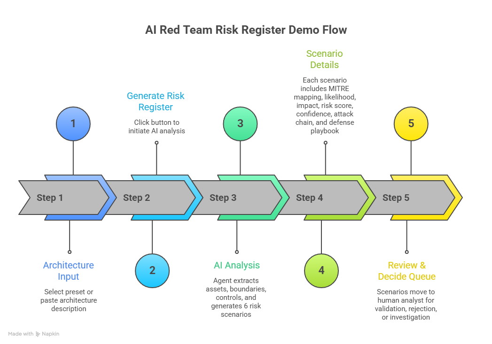

# AI Red Team Risk Register

AI-assisted security analysis tool that generates architecture-grounded attack scenarios and supports human review and risk decisions.

This project explores how AI can accelerate security analysis while keeping critical risk decisions under human control.

Given a system architecture description, the agent:

1. extracts the **risk surface**
2. generates a **risk register of attack scenarios**
3. models **risk progression**
4. drafts **defense playbooks**
5. routes scenarios into a **human Review & Decide workflow**

The result is a structured risk register that security teams can review, validate, and act on.

---

# Demo Flow


The intended demo flow:

1. Select an **architecture preset** or paste an architecture description.
2. Click **Generate Risk Register**.
3. The AI agent:
   - extracts assets, trust boundaries, entry points, and controls
   - generates **6 architecture-grounded risk scenarios**
4. Each scenario includes:
   - MITRE ATT&CK mapping
   - likelihood and impact
   - risk score
   - confidence estimate
   - attack chain
   - defense playbook
5. Scenarios move into the **Review & Decide queue** where a human analyst decides whether to:
   - validate the scenario
   - reject it
   - request further investigation

This creates a clear separation between **AI analysis** and **human risk ownership**.

---

# Why Human Review Matters

Security risk decisions cannot be fully automated.

The system intentionally stops before the final decision.  
A human analyst must review each scenario and determine whether it should enter the validated risk register.

Reasons include:

- AI can misinterpret architecture context
- risk tolerance is a business decision
- security teams must control prioritization and ownership

The tool accelerates analysis, but **humans remain accountable for risk decisions**.

---

# System Architecture

The application is structured as a lightweight AI agent pipeline.

Flow:

Architecture Description  
→ Risk Surface Extraction  
→ Scenario Generation  
→ Attack Chain Modeling  
→ Defense Playbook Drafting  
→ Review & Decide (Human)

Key design goals:

- transparent reasoning
- schema-validated AI outputs
- safe security analysis (no exploit instructions)
- human-in-the-loop governance

---

# Example Scenario Output

Each generated scenario includes structured security metadata.

Example fields:

- title
- severity
- MITRE tactic and technique
- attack vector
- attack chain
- business impact
- evidence from architecture
- assumptions
- confidence score
- likelihood
- impact
- risk score
- recommended defense playbook

This format mirrors a typical **security risk register used in real organizations**.

---

# Key Features

- AI-assisted risk register generation  
- architecture-grounded scenario analysis  
- MITRE ATT&CK mapping  
- structured risk scoring  
- confidence estimates for each scenario  
- defense playbook suggestions  
- human review and governance workflow  
- schema-validated LLM outputs  

---

# Tech Stack

### Frontend
- Next.js
- React
- TypeScript
- TailwindCSS

### Backend / Agent
- Next.js API Routes
- Google Gemini API
- Zod schema validation

### Other
- Server-Sent Events for agent streaming
- structured scenario normalization
- PDF export for red team reports

---

# Safety Guardrails

The AI agent is intentionally restricted to **risk analysis only**.

The system will not generate:

- exploit payloads
- step-by-step attack instructions
- operational hacking guidance

Instead it focuses on:

- architectural risk conditions
- detection signals
- mitigation strategies

---

# Example Use Cases

- Security architecture review  
- Red team preparation  
- Risk register creation  
- Threat modeling acceleration  
- Security design reviews  

---

# What Would Break at Scale

The first scaling challenge would likely be **LLM latency and cost** when generating scenarios for large architectures.

Potential solutions include:

- architecture chunking
- risk surface caching
- model batching
- asynchronous generation pipelines

Another challenge would be **review workflow management** once hundreds of scenarios accumulate, requiring queue prioritization and ownership tracking.

---

# Running Locally

Install dependencies:

```bash
npm install
npm run dev
```
Add your API key:
``` bash
GEMINI_API_KEY=your_key_here
```

---
# Future Improvements
- improved architecture parsing
- multi-agent threat modeling
- scenario deduplication
- risk prioritization models
- collaborative review workflows
- SOC and SIEM integration
